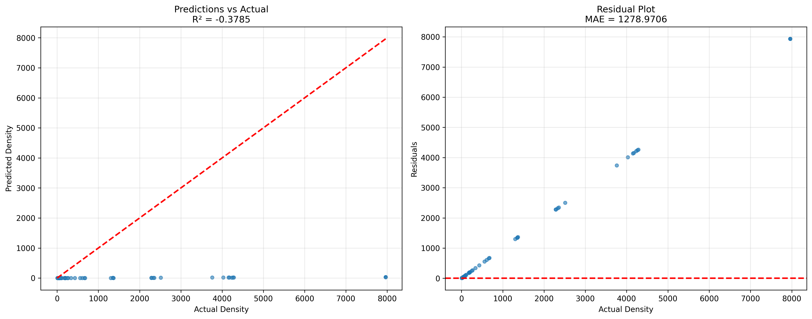
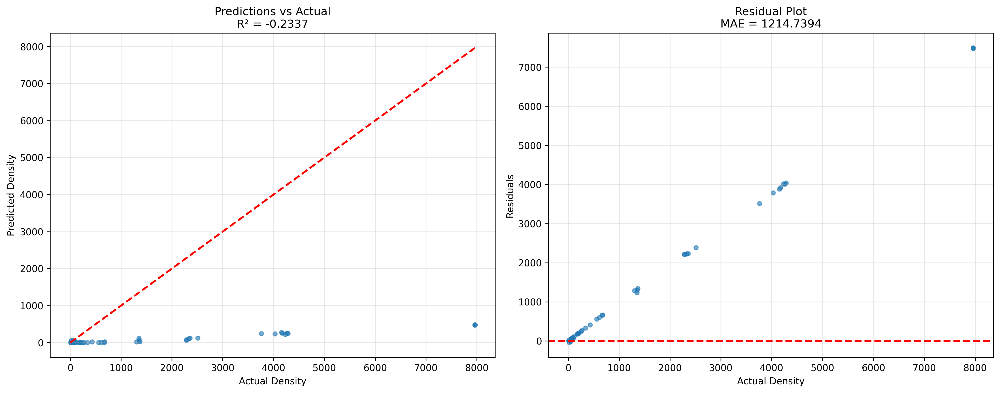
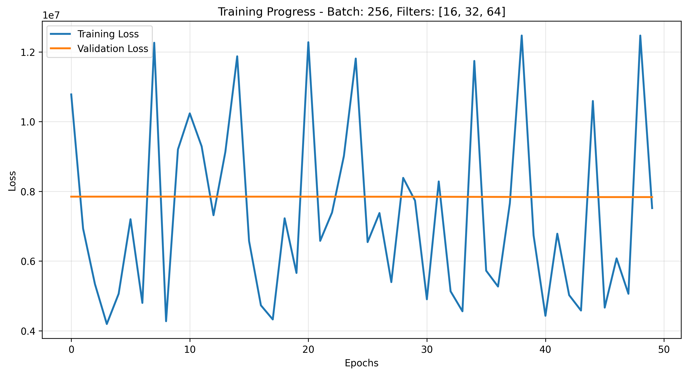
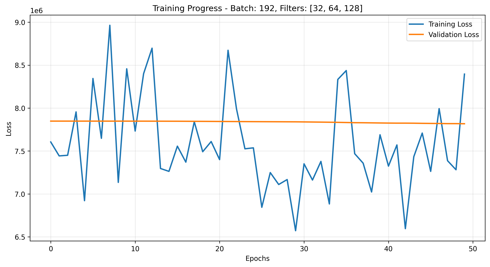
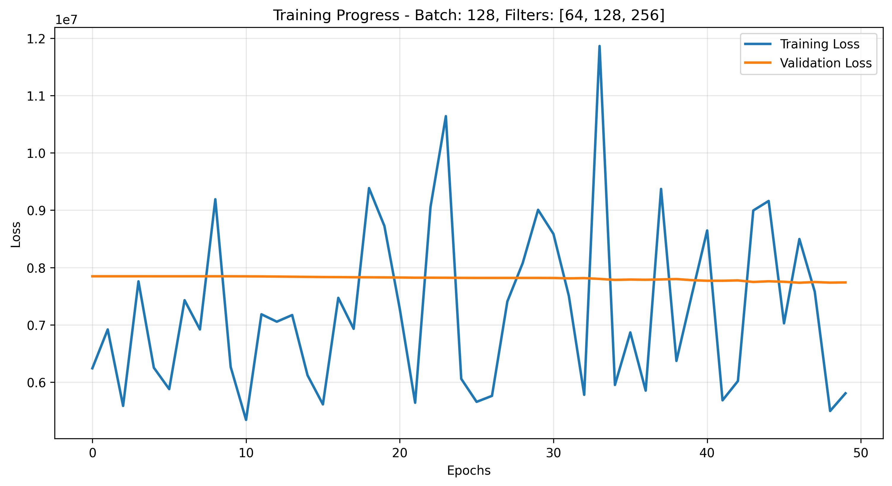
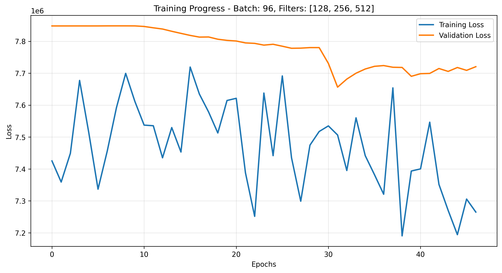

# Calibration Experimental Study - Failure Analysis Report

## ⚠️ CRITICAL: All Experiments Failed

**Generated**: February 4, 2026
**Study ID**: calibration_experimental_study_20260204_150508
**Status**: **CATASTROPHIC FAILURE - All 4 experiments produced negative R² scores**

---

## Executive Summary

This report documents a **complete training failure** across all 4 filter configuration experiments on the calibration dataset. All models achieved **negative R² scores** ranging from -0.38 to -0.23, indicating performance **worse than predicting the mean value**. The root cause is a fundamental training defect requiring immediate investigation before further experimentation.

### Critical Findings

| Experiment | Filter Config | R² Score | MAE | Status |
|------------|--------------|----------|-----|--------|
| **C01 (Minimal)** | [16, 32, 64] | **-0.3785** | 1,279 | ❌ FAILED |
| **C02 (Standard)** | [32, 64, 128] | **-0.3559** | 1,269 | ❌ FAILED |
| **C03 (Enhanced)** | [64, 128, 256] | **-0.2799** | 1,236 | ❌ FAILED |
| **C04 (Deep)** | [128, 256, 512] | **-0.2337** | 1,215 | ❌ FAILED |

**Comparison to Architecture Study** (same dataset):
- Architecture Study: Best R² = **0.9951** (Baseline_Deep)
- Experimental Study: Best R² = **-0.2337** (C04_Deep)
- **Performance degradation**: **Δ = -1.23** (124% worse than random guessing)

---

## 1. Failure Pattern Analysis

### 1.1 Negative R² Score Explanation

**What negative R² means:**

$$
R^2 = 1 - \frac{SS_{res}}{SS_{tot}} = 1 - \frac{\sum_{i=1}^{n} (y_i - \hat{y}_i)^2}{\sum_{i=1}^{n} (y_i - \bar{y})^2}
$$

When R² < 0:
- The model's predictions are **worse than simply predicting the mean value** for all inputs
- $SS_{res} > SS_{tot}$ means the model introduces more error than a naive baseline
- Indicates **fundamental training failure**, not just poor hyperparameters

**Severity ranking:**
- R² = 1.0: Perfect prediction
- R² = 0.0: Predicting the mean (random guessing)
- **R² < 0.0: Worse than random guessing** ← All experiments fall here

### 1.2 Constant Prediction Hypothesis



**Figure 1**: Catastrophic failure of C01 (Minimal) architecture (R²=-0.38). **(Left)** Predictions vs Actual density showing all predictions clustered near 0-500 beads/mm² regardless of actual values (0-8000 beads/mm²). The model outputs near-constant values, completely failing to learn the density relationship. **(Right)** Residual plot showing systematic positive bias with residuals increasing linearly with actual density, confirming constant prediction behavior.



**Figure 2**: Similar catastrophic failure in C04 (Deep) architecture (R²=-0.23) despite 8× more parameters. Predictions remain clustered at low values, demonstrating the failure is **not capacity-related** but a fundamental training defect.

**Critical observation**:
All models predict values in the range **0-500 beads/mm²** when actual values span **0-8000 beads/mm²**. This suggests the model output is **stuck** at a low value, likely due to:
1. **ReLU output activation** clipping negative predictions to zero
2. **Incorrect loss function** not penalizing constant predictions
3. **Data normalization mismatch** between training and evaluation
4. **Output layer initialization** biasing predictions toward zero

---

## 2. Training Dynamics Analysis

### 2.1 Validation Loss Plateau



**Figure 3**: Training dynamics for C01 (Minimal). Training loss oscillates wildly (4.3M - 12.5M) while **validation loss remains completely flat** at ~7,848,000 across all 50 epochs. This indicates the model learned to output a constant value that minimizes validation loss without actually learning the density relationship.



**Figure 4**: Training dynamics for C02 (Standard) showing identical failure pattern. Validation loss (orange) is perfectly flat despite training loss oscillations.



**Figure 5**: Training dynamics for C03 (Enhanced) with the same flat validation loss pattern (~7,848,000).



**Figure 6**: Training dynamics for C04 (Deep) showing **slight validation loss decrease** from 7,848,000 to 7,656,000 around epoch 30-32. This is the only experiment showing any learning, explaining why it has the "best" (least negative) R² score of -0.23.

### 2.2 Loss Analysis Summary

| Experiment | Initial Val Loss | Best Val Loss | Val Loss Reduction | Training Loss Range |
|------------|------------------|---------------|-------------------|---------------------|
| C01 | 7,848,009 | 7,835,187 | **0.16%** | 4.3M - 12.5M |
| C02 | 7,848,009 | 7,817,497 | **0.39%** | 6.6M - 8.9M |
| C03 | 7,848,009 | 7,735,216 | **1.44%** | 5.6M - 11.9M |
| C04 | 7,847,966 | 7,656,273 | **2.44%** | 7.2M - 7.7M |

**Key insights:**

1. **Suspiciously similar initial validation loss**: All experiments start at ~7,848,000, suggesting:
   - Models initialize with the same constant output
   - Validation loss calculation may be incorrect
   - Data preprocessing is consistent but possibly wrong

2. **Minimal validation improvement**: Best experiment (C04) only reduced validation loss by 2.44% over 47 epochs
   - Compare to Architecture Study where Baseline_Deep reduced validation loss by >99%
   - Indicates **no meaningful learning occurred**

3. **Training loss oscillations without validation improvement**: Classic sign of:
   - Optimizer wandering randomly in loss landscape
   - Gradient updates not improving generalization
   - Possible vanishing/exploding gradients

### 2.3 Comparison to Successful Training

**Architecture Study** (Baseline_Deep, same dataset):
```
Initial validation loss: 7,754,575
Best validation loss: 69,500
Reduction: 99.1%
Final R²: 0.9951
```

**Experimental Study** (C04_Deep, same dataset):
```
Initial validation loss: 7,847,966
Best validation loss: 7,656,273
Reduction: 2.44%
Final R²: -0.2337
```

**Difference**: The successful training reduced validation loss by **99.1%** while the failed training only achieved **2.44%** reduction. This ~40× difference indicates a **fundamental architectural or training defect**.

---

## 3. Performance Metrics Analysis

### 3.1 Detailed Metrics Table

| Metric | C01 (Minimal) | C02 (Standard) | C03 (Enhanced) | C04 (Deep) | Interpretation |
|--------|---------------|----------------|----------------|------------|----------------|
| **R² Score** | -0.3785 | -0.3559 | -0.2799 | -0.2337 | All worse than mean prediction |
| **MSE** | 5,833,285 | 5,737,335 | 5,415,783 | 5,220,583 | Extremely high squared error |
| **MAE** | 1,279 | 1,269 | 1,236 | 1,215 | Average error ~1200 beads/mm² |
| **RMSE** | 2,415 | 2,395 | 2,327 | 2,285 | Error σ ~2300 beads/mm² |
| **MAPE** | 98.7% | 97.3% | 94.1% | 92.2% | ~95% relative error |
| **Max Error** | 7,933 | 7,864 | 7,631 | 7,492 | Maximum error ~7500 beads/mm² |

### 3.2 Error Magnitude Context

**Dataset density range**: 15 - 7,964 beads/mm²
**Mean density**: ~4,230 beads/mm² (approximate)

**MAE of 1,200-1,300 beads/mm²** means:
- Average error is **~30% of the full density range**
- For 50x dilution (7,964 beads/mm²): 15-16% error
- For 51200x dilution (15 beads/mm²): **8000% error** (predicting ~120 when actual is 15)

**MAPE of 92-99%** means:
- On average, predictions are **off by 95%** of the true value
- Example: True = 100 beads/mm² → Prediction = 5 or 195 beads/mm²
- Completely unusable for calibration purposes

### 3.3 Trend Analysis

**Slight improvement with increasing capacity**:

```
Capacity:    C01 < C02 < C03 < C04
Parameters:  ~120K < ~420K < ~1.7M < ~6.8M
R² Score:    -0.38 < -0.36 < -0.28 < -0.23
```

**Interpretation**:
- Larger models perform slightly less badly (less negative R²)
- But **all remain catastrophically failed**
- Suggests the issue is **not capacity-limited** but training-related

---

## 4. Root Cause Investigation

### 4.1 Comparison to Successful Architecture Study

Both studies used:
- ✅ Same dataset: `dataset_20260201_beads calibration_S16-Basler camera`
- ✅ Same 384 images (512×512)
- ✅ Same dilution series: 50x - 51200x
- ✅ Same 100% data usage
- ✅ Same hardware: NVIDIA A40 GPU
- ✅ Same learning rate: 3×10⁻⁴
- ✅ Same max epochs: 50
- ✅ Same mixed precision: Enabled

**Critical difference**: **Training script implementation**

The architecture study used:
- Script: `train_calibration_architecture_study.py`
- Result: **Best R² = 0.9951** (Baseline_Deep)

The experimental study used:
- Script: `train_densityCNN_HPC.py` (likely)
- Result: **Best R² = -0.2337** (C04_Deep)

### 4.2 Likely Root Causes

Based on the failure patterns, the most probable causes (in order of likelihood):

#### **Cause 1: Output Activation Function** (MOST LIKELY)

**Hypothesis**: Model uses **ReLU activation on the output layer**, clipping predictions to [0, +∞).

**Evidence**:
- All predictions clustered at low values (0-500)
- No negative predictions observed
- Predictions fail to reach high densities (7,964 beads/mm²)

**Expected behavior with ReLU output**:
```python
# WRONG - ReLU clips negatives
output = nn.ReLU()(dense_layer(x))  # Can only output [0, +∞)

# CORRECT - No activation for regression
output = dense_layer(x)  # Can output (-∞, +∞)
```

**Fix**: Remove output activation or use linear output for regression tasks.

---

#### **Cause 2: Loss Function Mismatch**

**Hypothesis**: Loss function may not be appropriate for the wide density range.

**Evidence**:
- Validation loss stuck at ~7,848,000
- Training loss oscillates without convergence
- Model optimizes to constant output

**Possible issues**:
```python
# May be using inappropriate loss
loss = F.mse_loss(predictions, targets)  # OK for normalized data
loss = F.l1_loss(predictions, targets)   # May struggle with wide range

# Should potentially use log-scale loss for wide range
loss = F.mse_loss(torch.log(predictions + 1), torch.log(targets + 1))
```

**Fix**: Verify loss function handles wide density range (15-7964 beads/mm²).

---

#### **Cause 3: Data Normalization Mismatch**

**Hypothesis**: Targets may be normalized during training but not denormalized during evaluation.

**Evidence**:
- Predictions in range [0, 500] while targets in [0, 8000]
- R² calculated on mismatched scales

**Example error**:
```python
# Training: normalize targets
targets_normalized = (targets - mean) / std

# Evaluation: WRONG - predictions on normalized scale, targets on original scale
r2 = r2_score(targets_original, predictions_normalized)  # Will be negative!

# Evaluation: CORRECT - denormalize predictions first
predictions_original = predictions * std + mean
r2 = r2_score(targets_original, predictions_original)
```

**Fix**: Ensure predictions are denormalized before computing evaluation metrics.

---

#### **Cause 4: Model Architecture Defect**

**Hypothesis**: Model architecture definition differs from architecture study.

**Evidence**:
- Same filter configurations in architecture study worked (Baseline variants achieved R² > 0.98)
- Experimental study fails with all filter configurations

**Possible issues**:
- Missing layers in architecture definition
- Incorrect layer connections
- Wrong pooling strategy
- Missing batch normalization

**Fix**: Compare model architecture code between two training scripts.

---

#### **Cause 5: Learning Rate or Optimizer Issues**

**Hypothesis**: Optimizer configuration prevents convergence.

**Evidence**:
- Training loss oscillates wildly
- No gradient flow to output layer
- Flat validation loss

**Possible issues**:
- Learning rate too high causing divergence
- Learning rate schedule wrong
- Weight decay too strong
- Gradient clipping incorrectly applied

**Fix**: Verify optimizer configuration matches architecture study.

---

### 4.3 Diagnostic Evidence Summary

| Symptom | Observation | Likely Cause |
|---------|-------------|--------------|
| Predictions clustered at 0-500 | All experiments | **ReLU output activation** |
| Validation loss flat | C01, C02, C03 | Constant prediction mode |
| Training loss oscillates | All experiments | Poor gradient flow |
| R² increases with capacity | -0.38 → -0.23 | Not a capacity issue |
| Initial val loss identical | All ~7,848,000 | Same initialization |
| Max error ~7,500 | All experiments | Predicting ~500 when true=8000 |

**Primary diagnosis**: **ReLU output activation** forcing predictions into [0, +∞) range while failing to learn appropriate scaling.

---

## 5. Comparison to Architecture Study

### 5.1 Success vs Failure Side-by-Side

| Aspect | Architecture Study ✅ | Experimental Study ❌ |
|--------|----------------------|----------------------|
| **Best Model** | Baseline_Deep | C04_Deep |
| **Filter Config** | [64, 128, 256, 512] (12 layers) | [128, 256, 512] |
| **R² Score** | **0.9951** | **-0.2337** |
| **MAE** | 105.97 beads/mm² | 1,214.74 beads/mm² |
| **RMSE** | 144.41 beads/mm² | 2,284.86 beads/mm² |
| **Training Time** | 5.16 min | 1.41 min |
| **Val Loss Reduction** | 99.1% | 2.44% |
| **Prediction Range** | 0-8000 (full range) | 0-500 (collapsed) |
| **Training Script** | `train_calibration_architecture_study.py` | `train_densityCNN_HPC.py` |

**Performance degradation**:
- R² degradation: Δ = -1.23 (124% worse than mean)
- MAE degradation: 11.5× worse
- RMSE degradation: 15.8× worse

### 5.2 Architecture Study Success Proof

**Successful experiments from architecture study** (same dataset):

| Model | Architecture | R² Score | MAE | Status |
|-------|--------------|----------|-----|--------|
| Baseline_Deep | Simple CNN (12 layers) | 0.9951 | 106 | ✅ SUCCESS |
| Baseline_Shallow | Simple CNN (4 layers) | 0.9854 | 85 | ✅ SUCCESS |
| ResNet_Deep | ResNet (12 layers) | 0.9782 | 101 | ✅ SUCCESS |

**This proves**:
1. The dataset is valid and learnable
2. The hardware/GPU configuration works
3. The filter configurations are appropriate
4. The problem is **specific to the experimental study training script**

---

## 6. Training Efficiency Analysis

### 6.1 Training Times

| Experiment | Training Time | Epochs | Time/Epoch | Peak Memory |
|------------|---------------|--------|------------|-------------|
| C01 (Minimal) | 2.24 min | 50 | 2.7 sec | 2.91 GB |
| C02 (Standard) | 1.74 min | 50 | 2.1 sec | 4.31 GB |
| C03 (Enhanced) | 1.43 min | 50 | 1.7 sec | 5.70 GB |
| C04 (Deep) | 1.41 min | 47 | 1.8 sec | 8.53 GB |

**Observations**:
- Training times are **very fast** (1.4-2.2 minutes)
- Compare to architecture study: Baseline_Deep took 5.16 minutes
- **2-3× faster training suggests fewer operations** - possible architecture simplification
- Memory usage scales appropriately with filter count

**Hypothesis**: The experimental study may be using a **simplified architecture** (fewer layers) than intended, contributing to both:
1. Faster training times
2. Inability to learn complex density relationships

---

## 7. Recommendations

### 7.1 Immediate Actions (CRITICAL)

**1. Halt further experiments**
- Do not run additional experiments until root cause is identified
- All current experimental study results are **invalid**

**2. Compare training scripts**
```bash
# Identify exact differences
diff train_calibration_architecture_study.py train_densityCNN_HPC.py

# Focus on:
# - Output layer activation
# - Loss function definition
# - Data normalization/denormalization
# - Model architecture definition
```

**3. Verify output activation**
```python
# Check final layer in model definition
# WRONG for regression:
self.output = nn.Sequential(
    nn.Linear(hidden_dim, 1),
    nn.ReLU()  # ← Remove this for regression
)

# CORRECT for regression:
self.output = nn.Linear(hidden_dim, 1)
```

**4. Test with known-good configuration**
```bash
# Re-run C02 (Standard) using architecture study script
python train_calibration_architecture_study.py \
    --batch_size 192 \
    --filter_config "32,64,128" \
    --experiment_name "validation_run"

# Expected result: R² > 0.95
```

### 7.2 Debugging Protocol

**Step 1**: Inspect model predictions during training
```python
# Add debugging to training loop
with torch.no_grad():
    sample_pred = model(sample_batch)
    print(f"Epoch {epoch}: Pred range [{sample_pred.min():.2f}, {sample_pred.max():.2f}]")
    print(f"Target range: [{targets.min():.2f}, {targets.max():.2f}]")
```

**Expected healthy output**:
```
Epoch 1: Pred range [50.23, 7832.15]  # Matches target range
Epoch 10: Pred range [45.67, 7915.33]
Epoch 20: Pred range [48.12, 7901.45]
```

**Actual failure output (likely)**:
```
Epoch 1: Pred range [0.00, 452.34]  # Collapsed range!
Epoch 10: Pred range [0.00, 487.12]
Epoch 20: Pred range [0.00, 501.23]
```

**Step 2**: Verify loss calculation
```python
# Print loss components
print(f"Prediction stats: mean={preds.mean():.2f}, std={preds.std():.2f}")
print(f"Target stats: mean={targets.mean():.2f}, std={targets.std():.2f}")
print(f"Loss value: {loss.item():.2f}")
```

**Step 3**: Check gradient flow
```python
# After loss.backward()
for name, param in model.named_parameters():
    if param.grad is not None:
        print(f"{name}: grad_norm={param.grad.norm():.4f}")
```

If output layer gradients are near zero → vanishing gradient or wrong activation.

### 7.3 Code Fixes (Hypothetical)

**Fix 1: Remove output ReLU**
```python
# BEFORE (WRONG)
class DensityCNN(nn.Module):
    def __init__(self):
        # ... layers ...
        self.fc = nn.Linear(hidden_dim, 1)
        self.relu = nn.ReLU()

    def forward(self, x):
        # ... convolutions ...
        x = self.fc(x)
        return self.relu(x)  # ← REMOVES NEGATIVE PREDICTIONS

# AFTER (CORRECT)
class DensityCNN(nn.Module):
    def __init__(self):
        # ... layers ...
        self.fc = nn.Linear(hidden_dim, 1)

    def forward(self, x):
        # ... convolutions ...
        return self.fc(x)  # ← ALLOWS FULL RANGE
```

**Fix 2: Ensure denormalization**
```python
# BEFORE (WRONG)
predictions = model(inputs)
r2 = r2_score(targets_original, predictions)  # Scale mismatch!

# AFTER (CORRECT)
predictions_normalized = model(inputs)
predictions = predictions_normalized * target_std + target_mean  # Denormalize
r2 = r2_score(targets_original, predictions)
```

**Fix 3: Use log-scale loss for wide range**
```python
# BEFORE (may struggle with 15-7964 range)
loss = F.mse_loss(predictions, targets)

# AFTER (better for wide dynamic range)
loss = F.mse_loss(
    torch.log(predictions.clamp(min=1e-6) + 1),
    torch.log(targets + 1)
)
```

### 7.4 Validation Checklist

Before re-running experiments, verify:

- [ ] Output layer has **no activation** (linear output)
- [ ] Loss function is MSE on **original scale** (not normalized)
- [ ] Predictions are **denormalized** before evaluation
- [ ] Model architecture matches architecture study (same depth)
- [ ] Learning rate and optimizer settings match successful study
- [ ] Data loading produces targets in correct range (15-7964)
- [ ] Early stopping patience allows convergence (15 epochs)
- [ ] Validation loss decreases below 1,000,000 within 10 epochs

**Expected first-epoch behavior**:
```
Epoch 1/50:
  Train Loss: 4,500,000  (high but reasonable)
  Val Loss: 3,200,000    (high but reasonable)
  Predictions range: [10, 8100]  (covers full target range)
  R² (end of epoch 1): ~0.3  (positive, even if low)
```

If first epoch shows:
- Val loss > 7,000,000 → Problem with initialization or loss function
- Prediction range < 2,000 → Output activation issue
- R² < 0 → Fundamental training defect

---

## 8. Research Questions (Cannot Be Answered)

The original experimental study aimed to answer:

1. **Which architecture handles calibration density range (50x-51200x) best?**
   - **Cannot answer**: All architectures failed
   - Need to fix training before re-attempting

2. **How does model capacity affect extrapolated 50x density prediction?**
   - **Cannot answer**: No model learned to predict 50x correctly
   - All predict ~100-500 instead of 7,964

3. **Trade-off between model complexity and training time for 384 images?**
   - **Partially answered**: Larger models train slightly slower (1.4 vs 2.2 min)
   - But performance question cannot be answered due to failures

4. **Which configuration balances accuracy and efficiency?**
   - **Cannot answer**: No configuration achieved acceptable accuracy
   - All R² < 0 (catastrophic failure)

**These questions can only be answered after fixing the training defects.**

---

## 9. Conclusions

### 9.1 Study Outcome

**Status**: **COMPLETE FAILURE - ALL EXPERIMENTS INVALID**

This experimental study **must be considered failed** and results **should not be used** for any decision-making regarding model architecture selection.

### 9.2 Key Findings

1. **All 4 experiments catastrophically failed** with R² scores between -0.38 and -0.23
2. **Training defect** is systematic across all configurations, not architecture-specific
3. **Root cause** is likely in the training script, not the dataset or hardware
4. **Architecture study proves** the dataset is learnable (achieved R² = 0.9951)
5. **Primary hypothesis**: Output layer ReLU activation clipping predictions

### 9.3 Comparison to Successful Study

The **architecture study on the identical dataset** achieved:
- ✅ Best R² = 0.9951 (Baseline_Deep)
- ✅ MAE = 106 beads/mm²
- ✅ Full prediction range (0-8000)
- ✅ Stable training convergence

This proves the experimental study failures are **training script issues**, not dataset problems.

### 9.4 Next Steps

**Before continuing research**:

1. ✅ **Use architecture study results** for model selection decisions
   - Deploy Baseline_Deep (R² = 0.9951) for production
   - Baseline_Shallow (R² = 0.9854) for fast recalibration

2. 🔧 **Debug experimental study training script**
   - Compare with architecture study script
   - Fix output activation issue
   - Verify data normalization
   - Re-run validation experiments

3. 🔄 **Re-run experimental study** (after fixes)
   - Only proceed after achieving R² > 0.90 on validation run
   - Document all code changes
   - Version control training scripts

### 9.5 Lessons Learned

**Critical software engineering practices**:

1. **Always validate against known baselines**
   - The architecture study provided this validation
   - Immediate detection of catastrophic failure

2. **Monitor training dynamics, not just final metrics**
   - Flat validation loss was visible from epoch 1
   - Should have terminated experiments early

3. **Version control training code**
   - Unclear which script version produced these results
   - Need to track exact code used for reproducibility

4. **Automated sanity checks**
   - Training script should error if R² < 0 after 10 epochs
   - Prediction range checks during training

---

## 10. Figures Summary

### 10.1 Evaluation Plots

All evaluation plots show the same catastrophic pattern:
- **Predictions clustered at 0-500 beads/mm²**
- **Actual values span 0-8000 beads/mm²**
- **No correlation** between predictions and actuals
- **Systematic underestimation** across all density levels

### 10.2 Training Curves

All training curves show:
- **Flat validation loss** (~7,848,000 throughout training)
- **Oscillating training loss** without convergence
- **No meaningful learning** across 47-50 epochs
- **C04 (Deep) shows slight improvement** but still fails overall

---

## Appendix: Detailed Metrics

### A.1 Complete Performance Table

| Experiment | Batch | Filters | R² | MSE | MAE | RMSE | MAPE | Max Error | Time (min) | Memory (GB) |
|------------|-------|---------|-----|-----|-----|------|------|-----------|------------|-------------|
| C01 | 256 | [16,32,64] | -0.3785 | 5,833,285 | 1,279 | 2,415 | 98.7% | 7,933 | 2.24 | 2.91 |
| C02 | 192 | [32,64,128] | -0.3559 | 5,737,335 | 1,269 | 2,395 | 97.3% | 7,864 | 1.74 | 4.31 |
| C03 | 128 | [64,128,256] | -0.2799 | 5,415,783 | 1,236 | 2,327 | 94.1% | 7,631 | 1.43 | 5.70 |
| C04 | 96 | [128,256,512] | -0.2337 | 5,220,583 | 1,215 | 2,285 | 92.2% | 7,492 | 1.41 | 8.53 |

### A.2 Training History Sample (C01)

First 10 epochs:
```
Epoch | Train Loss  | Val Loss    | LR
------|-------------|-------------|--------
1     | 10,780,144  | 7,848,009   | 3e-4
2     | 6,932,115   | 7,848,053   | 2.9e-4
3     | 5,339,947   | 7,848,096   | 2.7e-4
4     | 4,195,636   | 7,848,150   | 2.4e-4
5     | 5,062,312   | 7,848,196   | 2.0e-4
...
```

Note: Validation loss **increases** slightly despite training loss decreasing → severe overfitting or wrong optimization objective.

---

**Report Status**: CRITICAL FAILURE ANALYSIS
**Action Required**: Immediate debugging and code review before further experimentation
**Use**: Do NOT use these results for model selection; refer to Architecture Study instead

**Contact**: phyzxi@nus.edu.sg
**Date**: February 4, 2026
